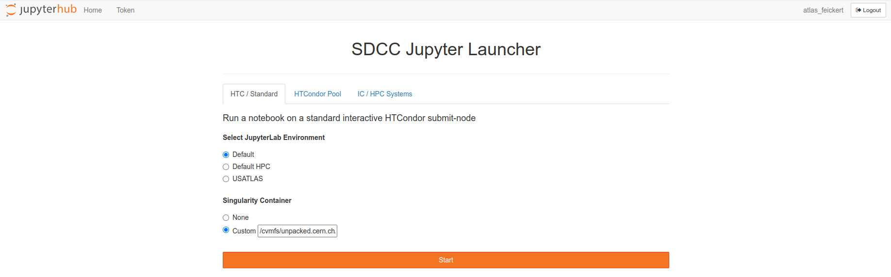
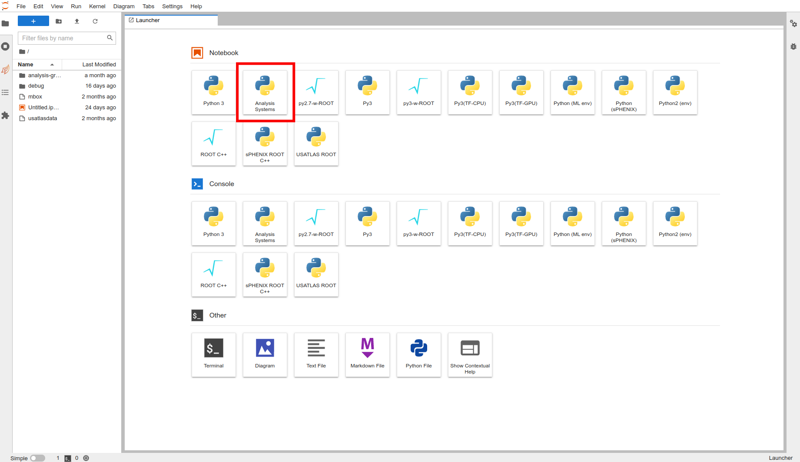

class: middle, center, title-slide
count: false

# Integrating AGC pipeline at BNL facility

.huge.blue[Matthew Feickert]<br>
.large[(University of Wisconsin-Madison)]
<br>
[matthew.feickert@cern.ch](mailto:matthew.feickert@cern.ch)

[IRIS-HEP / AGC Demo Day December 2022](https://indico.cern.ch/event/1218004/#4-integrating-agc-pipeline-at)
<br>
November 23rd, 2022

.middle-logo[]

---
# Introduction and Overview

.huge[
- This work is really all thanks to BNL team
      - Doug Benjamin
      - Ofer Rind
      - Chris Hollowell
- Ongoing process, but today just showing the first (unoptimized) steps that came together pleasantly quickly
- Today showing examples of running at BNL's SDCC Jupyter instance
]

---
# BNL SDCC Jupyter Launcher: custom images!

.center.width-100[[](https://atlas-jupyter-test.sdcc.bnl.gov/)]

.center[Allows for running custom images as Singularity containers]
.center[Can pull from public image registries or from CVMFS unpacked]

---
# Development image: analysis-systems-base

.kol-1-2.huge[
- As we can use custom images at BNL created the `analysis-systems-base` image (https://github.com/iris-hep/analysis-systems-base)
- Images are hosted on [OSG Harbor](https://hub.opensciencegrid.org/harbor/projects/863/repositories/analysis-systems-base) under `iris-hep` org
   - `hub.opensciencegrid.org/iris-hep/analysis-systems-base`
   - Thanks Brian Lin for making this happen!
]
.kol-1-2[
.center.width-100[[](https://github.com/iris-hep/analysis-systems-base)]
]

---
# Development image: analysis-systems-base

.kol-1-2.huge[
- As we can use custom images at BNL created the `analysis-systems-base` image (https://github.com/iris-hep/analysis-systems-base)
- Goal is to use lock files to make as much of the image as fully reproducible as possible and statically defined.
]
.kol-1-2[
.center.width-70[[](https://github.com/iris-hep/analysis-systems-base)]
]

---
# BNL SDCC Jupyter Launcher: custom images!

.center.width-100[[](https://atlas-jupyter-test.sdcc.bnl.gov/)]

.center.huge.bold[Today's demo:]
.huge.bold[`/cvmfs/unpacked.cern.ch/hub.opensciencegrid.org/iris-hep/analysis-systems-base:2022-12-15`]

---
# WIP: Custom kernel discovery

.center.width-75[[](https://atlas-jupyter-test.sdcc.bnl.gov/)]

.large[At the moment, lacking mounting (or something else) to mount custom kernels from user defined virtual environments]

---
# WIP: Custom kernel discovery

.bold[
```
Singularity> mkdir -p ~/.local/share/jupyter/kernels
Singularity> ln --symbolic \
   /opt/micromamba/envs/analysis-systems/share/jupyter/kernels/analysis-systems \
   ~/.local/share/jupyter/kernels
Singularity>
```
]

<br>
.center.huge.bold[Hack for time being: Create custom symlink first time]
.center.huge.bold[(c.f. https://github.com/iris-hep/analysis-systems-base/issues/12)]

---
# WIP: Custom kernel discovery

.center.width-75[[](https://atlas-jupyter-test.sdcc.bnl.gov/)]

.center.huge.bold[Hack for time being: Create custom symlink first time]
.center.huge.bold[(c.f. https://github.com/iris-hep/analysis-systems-base/issues/12)]

---
# Example: [AGC CMS Open Data $t\bar{t}$ Analysis](https://github.com/iris-hep/analysis-grand-challenge/blob/b7dbb33e6e0acc971edfbfc3e30c25c58f5418b8/analyses/cms-open-data-ttbar/coffea.ipynb)

.huge[
- Doug has moved data to `/usatlas/atlas01/atlasdisk/users/benjamin/AGC/`
- Notebook runs end-to-end (good first start 🚀)
- BNL does not use Kubernetes, so not a Coffea-casa AF, so use global config
```python
...
PIPELINE = "coffea"  # pure coffea setup
USE_DASK = True  # enable Dask
AF = "local"  # local setup, not coffea-casa
AF_NAME = "bnl"  # Added on Matthew's fork
...
```
]

---
# Example: [AGC CMS Open Data $t\bar{t}$ Analysis](https://github.com/iris-hep/analysis-grand-challenge/blob/b7dbb33e6e0acc971edfbfc3e30c25c58f5418b8/analyses/cms-open-data-ttbar/coffea.ipynb)

.huge[
- Execute the data delivery pipeline step
]

```python
N_FILES_MAX_PER_SAMPLE = 10  # 157 GB
...
[########################################] | 100% Completed |  1min 32.6s
execution took 93.11 seconds
```

```python
N_FILES_MAX_PER_SAMPLE = 50  # 678 GB
...
[########################################] | 100% Completed |  6min 14.1s
execution took 375.80 seconds
```

```python
N_FILES_MAX_PER_SAMPLE = 100  # 1 TB
...
[########################################] | 100% Completed | 10min 10.0s
execution took 611.55 seconds
```

---
# Example: [AGC CMS Open Data $t\bar{t}$ Analysis](https://github.com/iris-hep/analysis-grand-challenge/blob/b7dbb33e6e0acc971edfbfc3e30c25c58f5418b8/analyses/cms-open-data-ttbar/coffea.ipynb)

.huge[
- Execute the data delivery pipeline step
- Nothing that I've done at BNL has been optimized yet (just doing defaults)
- .bold[N.B.] Need to get better information on how scaling is done at BNL (so comparisons are not valid here yet)
   - UChicago AF is running with `AF = "coffea_casa"` and so scaling across k8
]

.huge[
| Data   | BNL AF (sec)| | UChicago AF (sec)  |
|--------|----:|-|----:|
| 157 GB |  93 | |  65 |
| 678 GB | 375 | | 182 |
| 1 TB   | 611 | | 243 |
]
.center.bold[(The input files are all in the 1–2 GB range)]

.center.bold[Comparison of unoptimized numbers (don't try to 1:1 these)]


---
# Summary

.huge[
- Have a runnable environment for AGC at BNL AF (🚀)
- BNL team is working to make drop-in with custom images well specified and easy
- Things work, but to understand how scaling is working will need to improve the monitoring story
   - Currently don't have Dask dashboards detecting the Dask cluster
- Also need to try other AGC analyses and expand / modify environment
]

---
class: end-slide, center

.huge[Backup]

---

class: end-slide, center
count: false

The end.
