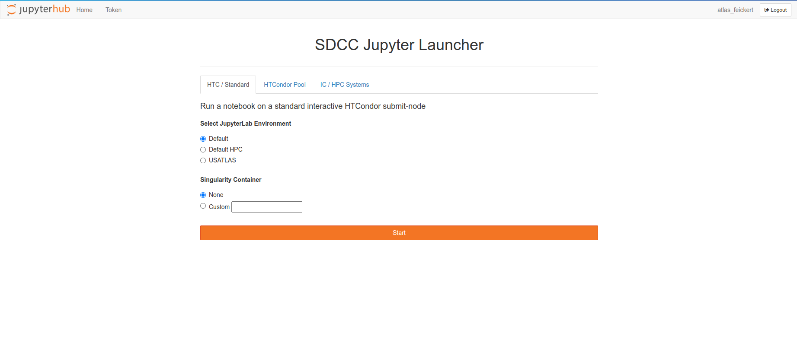
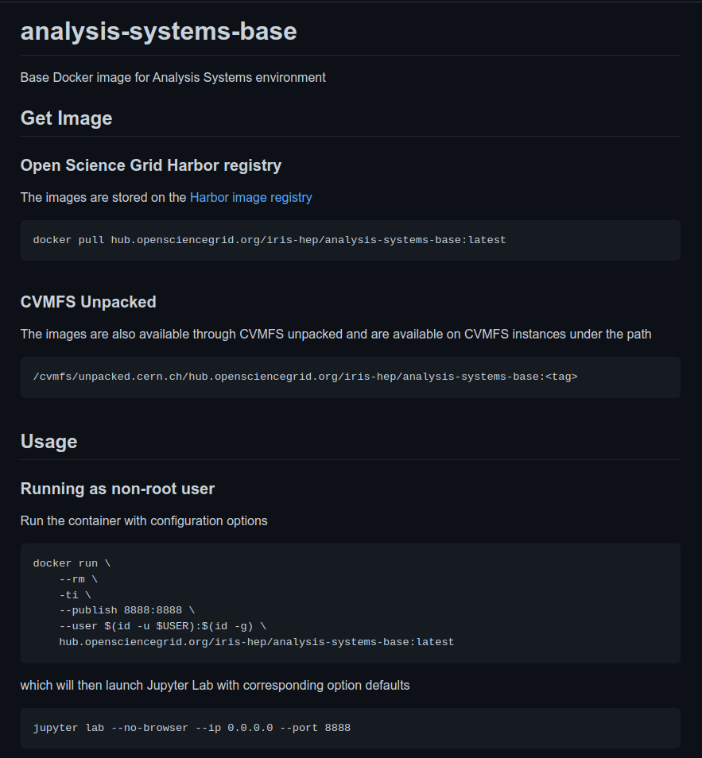
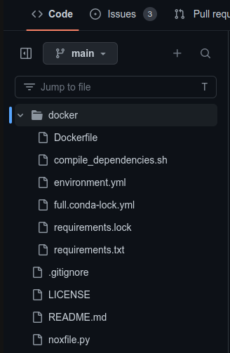

class: middle, center, title-slide
count: false

# Integrating AGC pipeline at BNL facility

.huge.blue[Matthew Feickert] 
.large[(University of Wisconsin-Madison)]
 
[matthew.feickert@cern.ch](mailto:matthew.feickert@cern.ch)

[IRIS-HEP / AGC Demo Day December 2022](https://indico.cern.ch/event/1211229/contributions/5120858/)
 
November 23rd, 2022

.middle-logo[]

---
# Introduction and Overview

.kol-1-1.large[
- This work is really all thanks to BNL team
      - Doug Benjamin
      - Ofer Rind
      - Chris Hollowell
- Ongoing process, but today just showing the first (unoptimized) first steps that came together pleasantly quickly
- Today showing examples of running at BNL's SDCC Jupyter instance
]

<!-- .kol-1-2.large[
- In Tuesday's session, Daniel Katz already gave very nice high level overview of software citation .bold[principles] and .bold[tools]
- This is an .red[opinionated] summary of the tooling landscape and examples of workflows
   - Full disclosure: Opinions formed from pyhf development and from Scikit-HEP community discussions (c.f. [Eduardo's talk](https://indico.cern.ch/event/1211229/contributions/5150204/)).
- Meant to be recommendations to software developers on making your work as .bold[easy to cite as possible]
   - These recommendations can transfer to experiment software as well
]
.kol-1-2[
  
.center.width-100[]
.center[[Daniel Katz's talk](https://indico.cern.ch/event/1211229/contributions/5120849/)]
] -->

---
# BNL SDCC Jupyter Launcher: custom images!

.center.width-100[]

.center[Allows for running custom images as Singularity containers]
.center[Can pull from public image registries or from CVMFS unpacked]

---
# Development image: analysis-systems-base

.kol-1-2.huge[
- As we can use custom images at BNL created the `analysis-systems-base` image (https://github.com/iris-hep/analysis-systems-base)
- Images are hosted on [OSG Harbor](https://hub.opensciencegrid.org/harbor/projects/863/repositories/analysis-systems-base) under `iris-hep` org
   - Thanks Brian Lin for making this happen!
]
.kol-1-2[
.center.width-100[]
]

---
# Development image: analysis-systems-base

.kol-1-2.huge[
- As we can use custom images at BNL created the `analysis-systems-base` image (https://github.com/iris-hep/analysis-systems-base)
- Goal is to use lock files to make as much of the image as fully reproducible as possible and statically defined.
]
.kol-1-2[
.center.width-70[]
]

---
# Summary
.kol-2-3.huge[
- Build community practices on top of .bold[established standards]
   <!-- - There are professional communities at work building tools, so we should join them, not rebuild a wheel -->
- If citation of your software is important to you, .bold[make it easy] for a user to find your citation information
- Modern standards like `CITATION.cff` allow for .bold[single source of citation information] that can be exported as needed
- Long term archives + [FAIR practices](https://indico.cern.ch/event/1211229/contributions/5120857/)
   - Zenodo provides automatically release information each release
]
.kol-1-3[
.center.width-80[]

.center.width-100[]
]

---
class: end-slide, center

.huge[Backup]

---

class: end-slide, center
count: false

The end.
